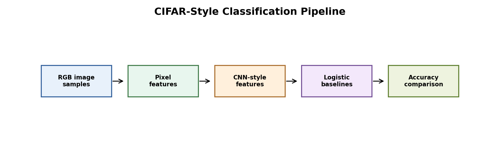

# CIFAR-10-Style Image Classification Baseline



Figure: image-classification baseline comparing raw pixels with convolution-style features.


## Motivation

Image classification baselines help us understand whether a model is learning useful visual patterns. Before training a large CNN, it is useful to compare simple pixel-based features with convolution-style features.

## Project Goal

We compared two baseline classifiers on a small CIFAR-10-style image task: logistic regression on raw pixels and logistic regression on hand-built convolution-style features.

## Dataset

The dataset contains controlled 16x16 RGB images with five visual classes. It is not the real CIFAR-10 dataset. The purpose is to build a runnable local baseline that shows the classification workflow.

## Tools

Python, NumPy, pandas, scikit-learn, and matplotlib.

## Method

The first model used flattened image pixels. The second model used color statistics, quadrant intensity features, and Sobel-style edge features, then trained logistic regression.

## Hyperparameters

- Samples: 1500
- Classes: 5
- Test split: 25 percent
- Logistic regression: `max_iter=1000`, `random_state=42`

## Results

| Model | Accuracy | Macro F1 |
|---|---:|---:|
| Pixel logistic regression | 1.0000 | 1.0000 |
| CNN-style feature logistic regression | 1.0000 | 1.0000 |

Result files include model metrics, classification reports, a sample image figure, and an accuracy comparison figure.

## Interpretation

Both baselines solved the controlled task perfectly because the visual patterns are simple and strongly separated. This does not mean the approach would solve real CIFAR-10. It means the pipeline works and the dataset is too easy for deeper model comparison.

## Conclusion

The project establishes an image-classification baseline. The next step should be real CIFAR-10 with a real CNN framework such as PyTorch or TensorFlow.

## How To Run

```bash
pip install -r requirements.txt
python 1_cifar10_style_baseline.py
```
