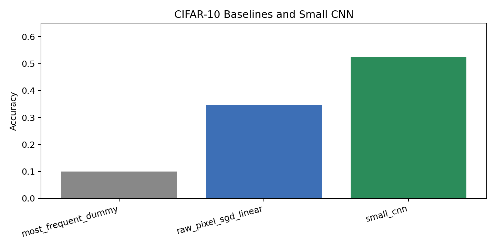
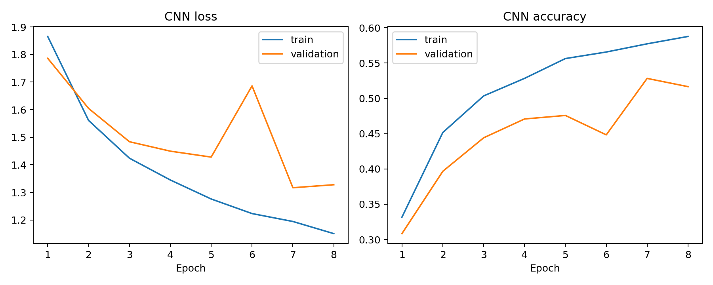
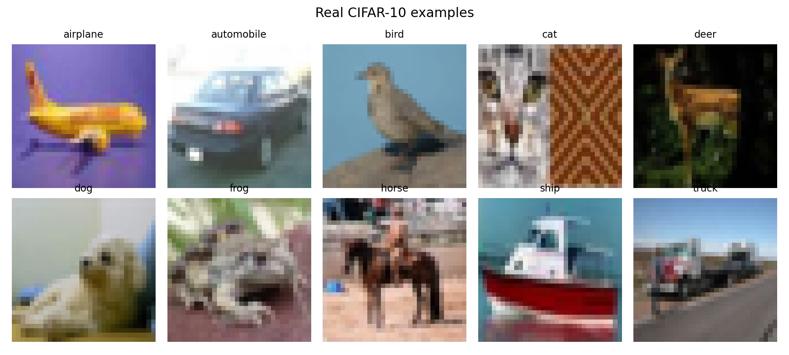

# CIFAR-10 CNN Image Classification Baseline


Figure: real CIFAR-10 images are evaluated with a dummy baseline, a linear pixel baseline, and a small convolutional neural network.

## Motivation

CIFAR-10 is harder than digit datasets because objects vary in color, background, pose, and texture. A CNN is appropriate for this task because convolution uses local spatial structure instead of treating every pixel as an unrelated feature.

## Project Goal

We compared simple baselines against a small CNN on real CIFAR-10.

## Dataset

We used the official CIFAR-10 Python archive.

- Training images: 8,000
- Test images: 2,000
- Classes: 10
- Image size: 32x32 RGB
- Balanced subset: 800 train images and 200 test images per class

The dataset is downloaded into `data/`, which is ignored by Git.

## Tools

Python, NumPy, pandas, scikit-learn, PyTorch, and matplotlib.

## Methods

We evaluated:

- Most-frequent dummy classifier
- SGD linear classifier on flattened RGB pixels
- Small CNN with three convolution blocks, batch normalization, ReLU, pooling, and a final linear classifier

CNN hyperparameters:

| Setting | Value |
|---|---:|
| Epochs | 8 |
| Batch size | 128 |
| Optimizer | Adam |
| Learning rate | 0.001 |
| Weight decay | 0.0001 |
| Best epoch | 7 |

## Results

| Model | Accuracy | Macro F1 |
|---|---:|---:|
| Most-frequent dummy | 0.1000 | 0.0182 |
| Raw pixel SGD linear | 0.3480 | 0.3521 |
| Small CNN | 0.5255 | 0.5331 |







## Interpretation

The CNN clearly outperforms the linear pixel baseline. This is expected because convolution preserves local image structure and learns spatial filters.

The result is still not state of the art. A small CPU-trained CNN on a subset reaches 52.55% accuracy, while stronger CIFAR-10 models need deeper architectures, augmentation, and longer training.

## Conclusion

This project is now a true CIFAR-10 CNN baseline. The main result is that convolution improves over linear pixels, but stronger models are needed for high-quality CIFAR-10 classification.

## How To Run

```bash
pip install -r requirements.txt
python 1_cifar10_cnn_baseline.py
```
